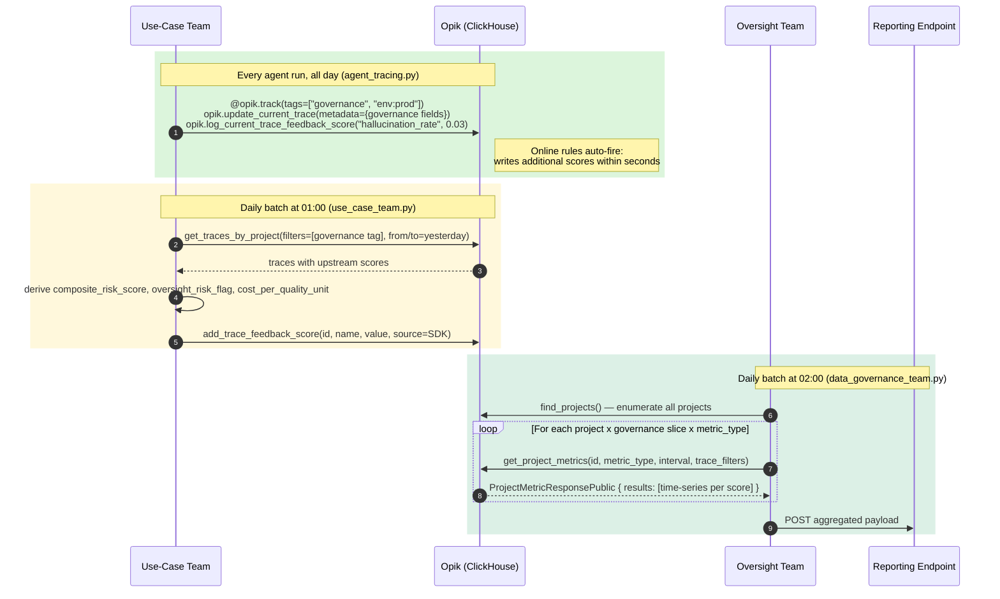

# Governance Observability with Opik: End-to-End Workflow

This guide explains how business unit teams instrument their AI agents for governance observability and how the oversight team extracts and aggregates metrics for reporting.

Two teams share one Opik workspace. They are decoupled by a single convention: every production trace is tagged `"governance"` and carries a standard set of governance metadata fields.

---

## Files in This Package

| File | Owner | Purpose |
|---|---|---|
| `agent_tracing.py` | Use-case team (BU) | Instrument an agent for production; log traces with governance tags and metadata |
| `use_case_team.py` | Use-case team (BU) | Run daily retrospective batch to derive composite metrics and write them back to traces |
| `data_governance_team.py` | Oversight team | Daily batch extraction; aggregate metrics across all projects and push to the reporting endpoint |
| `README.md` | Both | This guide |

---

## Architecture Overview

```
Business Unit Agent
        │
        │  @opik.track(tags=["governance", ...])
        │  opik.update_current_trace(metadata={...})
        │  opik.log_current_trace_feedback_score(...)
        ▼
┌──────────────────────────┐
│   Opik (ClickHouse)      │◄── Online rules fire automatically (seconds)
│   Traces + Feedback      │    Python metric rules
│   Scores                 │    LLM-judge rules
└──────────────────────────┘
        │
        │  Daily ~01:00  use_case_team.py
        │  Fetch yesterday's governance-tagged traces, derive composite scores, write back
        │
        │  Daily ~02:00  data_governance_team.py
        │  get_project_metrics() per project x governance slice x period window
        ▼
┌──────────────────────────┐
│   Reporting Endpoint     │
│   Aggregated dashboard   │
└──────────────────────────┘
```

---

## Sequence Diagram



---

## Case 1: Business Unit — Instrument Your Agent

### Step 1a: Log traces with tags and governance metadata

The `@opik.track` decorator is the simplest way to instrument any Python function. It automatically creates a trace and captures inputs and outputs.

**Reference:** [agent_tracing.py](./agent_tracing.py)

```python
import opik

@opik.track(
    name="loan_approval_assessment",
    tags=["governance", "use-case:loan-approval", "env:prod"],
    project_name="governance-data-demo",
)
def run_agent(query: str, request_id: str) -> str:
    # Attach governance metadata to the current trace
    opik.update_current_trace(
        metadata={
            "env":                 "prod",
            "region":              "us-east",
            "use_case_id":         "loan-approval",
            "use_case_version":    "2.1.0",
            "team":                "risk-analytics",
            "business_unit":       "retail",
            "model_name":          "gpt-4o",
            "model_version":       "2024-11-20",
            "risk_tier":           "high",
            "data_classification": "confidential",
            "regulatory_scope":    "internal",
        }
    )

    return "Assessment complete."
```

**Key SDK methods used:**
- [`@opik.track`](https://www.comet.com/docs/opik/tracing/log_traces#using-the-track-decorator) — decorator that creates a trace for a function
- [`opik.update_current_trace()`](https://www.comet.com/docs/opik/tracing/log_metadata) — attach metadata inside a decorated function
- [`opik.log_current_trace_feedback_score()`](https://www.comet.com/docs/opik/tracing/annotate_traces) — log a named numeric score on the current trace
- `opik.flush_tracker()` — flush all buffered traces before a script exits

### Step 1b: Register online evaluation rules (one-time, via the Opik UI)

Online rules run automatically inside Opik every time a new trace lands in a project. They are configured once per project in the Opik web app under **Project → Automation Rules**.

Two types of rules are available:

- **Python metric rules** — execute a custom Python class (heuristic logic, no LLM call). Write a class that implements the `BaseMetric` interface and paste it into the rule editor.
- **LLM-judge rules** — use an LLM to evaluate a trace output against a rubric defined as a system + user prompt with `{{output}}` / `{{input}}` placeholders.

Scores written by online rules appear on the trace alongside scores written by the agent, and are available to the retrospective batch (Step 1c) when it runs the following morning.

See the [online evaluation docs](https://www.comet.com/docs/opik/evaluation/online_evaluation) and the [built-in metrics reference](https://www.comet.com/docs/opik/evaluation/metrics/overview) for details.

### Step 1c: Retrospectively calculate and log custom metrics (daily batch)

After a day's traces are in Opik (with scores from the agent and online rules), the use-case team runs a daily job to derive composite business metrics and write them back to the same traces.

**Reference:** [use_case_team.py](./use_case_team.py)

```bash
python use_case_team.py
```

The batch script:
1. Fetches yesterday's governance-tagged traces from the project using `get_traces_by_project()`.
2. Reads the feedback scores already on each trace (`trace.feedback_scores`).
3. Derives composite metrics from those scores (pure Python arithmetic).
4. Writes the new derived scores back to each trace using `add_trace_feedback_score()`.

```python
from opik.rest_api.client import OpikApi
from opik.rest_api.types.feedback_score_source import FeedbackScoreSource

client = OpikApi(api_key=..., workspace_name=..., base_url=...)

# Fetch traces
response = client.traces.get_traces_by_project(
    project_id=project_id,
    filters='[{"field": "tags", "operator": "contains", "value": "governance"}]',
    from_time=yesterday_start,
    to_time=yesterday_end,
)

for trace in response.content:
    scores = {fs.name: fs.value for fs in (trace.feedback_scores or [])}

    composite_risk = (
        0.5 * scores.get("regulatory_compliance", 0)
        + 0.3 * (1.0 - scores.get("hallucination_rate", 0))
        + 0.2 * scores.get("response_quality",    0)
    )

    client.traces.add_trace_feedback_score(
        id=trace.id,
        name="composite_risk_score",
        value=round(composite_risk, 4),
        source=FeedbackScoreSource.SDK,
        reason="0.5×compliance + 0.3×grounding + 0.2×quality",
    )
```

**Key SDK / REST API methods used:**
- `client.traces.get_traces_by_project()` — page through traces with tag/time filters
- `client.traces.add_trace_feedback_score()` — write a new score back to a trace
- `FeedbackScoreSource.SDK` — marks the score as SDK-written (visible in the Opik UI)

---

## Case 2: Oversight Team — Extract and Aggregate Metrics

### Step 2: Run the daily aggregation batch

**Reference:** [data_governance_team.py](./data_governance_team.py)

```bash
python data_governance_team.py
```

The batch runs at ~02:00, one hour after the use-case team's batch, so all composite scores are present before aggregation.

The script:
1. Enumerates all projects in the workspace using `find_projects()`.
2. For each project with governance-tagged traces, calls `get_project_metrics()` for each configured metric type and interval. Opik / ClickHouse aggregates on the server side.
3. Builds a structured payload and POSTs to the reporting endpoint.

```python
from opik.rest_api.client import OpikApi
from opik.rest_api.types.trace_filter_public import TraceFilterPublic

client = OpikApi(api_key=..., workspace_name=..., base_url=...)

# Typed filter objects — multiple filters are AND-ed
trace_filters = [
    TraceFilterPublic(field="tags",     operator="contains", value="governance"),
    TraceFilterPublic(field="metadata", key="env",           operator="=", value="prod"),
    TraceFilterPublic(field="metadata", key="risk_tier",     operator="=", value="high"),
]

response = client.projects.get_project_metrics(
    id=project_id,
    metric_type="FEEDBACK_SCORES",
    interval="DAILY",
    interval_start=_now - timedelta(days=30),
    interval_end=_now,
    trace_filters=trace_filters,
)

# response.results is a list of ResultsNumberPublic — one per named score
for result in response.results:
    print(result.name)        # e.g. "composite_risk_score"
    for point in result.data:
        print(point.time, point.value)  # time-series data points
```

**Key SDK / REST API methods used:**
- `client.projects.find_projects()` — enumerate all projects in the workspace
- `client.projects.get_project_metrics()` — server-side aggregated time-series metrics

The script extracts `FEEDBACK_SCORES` at a `DAILY` interval by default. Both are set as constants (`METRIC_TYPES`, `INTERVAL`) at the top of `data_governance_team.py` and can be changed without touching the rest of the code.

Other available `metric_type` values include `TRACE_COUNT`, `COST`, `DURATION`, `TOKEN_USAGE`, and more. Available `interval` values are `"HOURLY"`, `"DAILY"`, `"WEEKLY"`, and `"TOTAL"`. See the full parameter reference in the [SDK docs for `get_project_metrics()`](https://www.comet.com/docs/opik/python-sdk-reference/rest_api/clients/projects.html#opik.rest_api.projects.client.ProjectsClient.get_project_metrics).

### Governance slices

The oversight team can compute one set of metric calls per governance slice so the reporting endpoint can filter by any combination:

| Slice label | Trace filters |
|---|---|
| `all` | governance tag only |
| `env=prod` | governance tag + metadata.env=prod |
| `risk_tier=high` | governance tag + metadata.risk_tier=high |
| `env=prod&risk_tier=high` | governance tag + env=prod + risk_tier=high |
| `business_unit=retail` | governance tag + metadata.business_unit=retail |

Filters use `TraceFilterPublic` objects. For metadata fields, set `field="metadata"` and `key=<field_name>`:

```python
TraceFilterPublic(field="metadata", key="env",            operator="=", value="prod")
TraceFilterPublic(field="metadata", key="risk_tier",       operator="=", value="high")
TraceFilterPublic(field="metadata", key="regulatory_scope",operator="=", value="internal")
TraceFilterPublic(field="metadata", key="business_unit",   operator="=", value="retail")
```

To enable slices, populate the `METADATA_SLICES` list at the top of `data_governance_team.py`. It defaults to empty (single unfiltered extraction).

---

## Governance Metadata Schema

All fields should be set on every production trace. The oversight team filters and slices using these fields.

| Field | Type | Example values | Used to slice by |
|---|---|---|---|
| `env` | string | `prod`, `staging`, `dev` | Environment |
| `region` | string | `us-east`, `eu`, `us` | Data residency / regulatory region |
| `use_case_id` | string | `loan-approval` | Use case |
| `use_case_version` | string | `2.1.0` | Version drift / rollout tracking |
| `team` | string | `risk-analytics` | Team-level reporting |
| `business_unit` | string | `retail`, `commercial`, `wealth` | Business unit |
| `model_name` | string | `gpt-4o`, `claude-3-5-sonnet` | Model comparison |
| `model_version` | string | `2024-11-20` | Model version / snapshot rollout |
| `risk_tier` | string | `high`, `medium`, `low` | Governance risk classification |
| `data_classification` | string | `confidential`, `internal`, `public` | Data sensitivity |
| `regulatory_scope` | string | `internal`, `external`, `none` | Regulatory regime |

Log via `opik.update_current_trace(metadata={...})` inside a `@opik.track`-decorated function.

---

## Score Inventory on a Completed Trace

| Score | Written by | Timing |
|---|---|---|
| `hallucination_rate` | Agent (BU, inline) | Same day, real-time |
| `response_quality` | Agent (BU, inline) | Same day, real-time |
| `cost_usd` | Agent (BU, inline) | Same day, real-time |
| `regulatory_compliance` | Online LLM-judge rule (auto) | Same day, within minutes |
| `composite_risk_score` | BU batch job | T+1, ~01:00 |
| `oversight_risk_flag` | BU batch job | T+1, ~01:00 |
| `cost_per_quality_unit` | BU batch job | T+1, ~01:00 |

---

## Cron Schedule

```
0 1 * * *   python use_case_team.py
0 2 * * *   python data_governance_team.py
```

Register online evaluation rules once per project via the Opik web app (Project → Automation Rules) when onboarding a new use case.

---

## Setup

### Environment variables

All scripts read credentials from environment variables. Set these in your shell profile (e.g. `~/.zshrc` or `~/.bashrc`) and then run the scripts directly:

```bash
export OPIK_API_KEY="your-api-key"
export OPIK_WORKSPACE="your-workspace"
```

| Variable | Required | Description |
|---|---|---|
| `OPIK_API_KEY` | Yes | API key for authentication |
| `OPIK_WORKSPACE` | Yes | Workspace name (matches your Opik workspace) |
| `OPIK_PROJECT_NAME` | No | Project name traces are logged to (defaults to `governance-data-demo`) |
| `OPIK_URL_OVERRIDE` | No | Base URL for self-hosted deployments (default: `https://www.comet.com/opik/api`) |
| `OVERSIGHT_INGEST_URL` | No | URL for the reporting/ingestion endpoint |

### Python dependencies

```bash
uv sync
source .venv/bin/activate
```

---

## Opik Documentation Links

| Topic | URL |
|---|---|
| Logging traces (decorator) | https://www.comet.com/docs/opik/tracing/log_traces#using-the-track-decorator |
| Logging traces (SDK) | https://www.comet.com/docs/opik/tracing/log_traces#using-the-python-sdk |
| Logging metadata | https://www.comet.com/docs/opik/tracing/log_metadata |
| Annotating traces (feedback scores) | https://www.comet.com/docs/opik/tracing/annotate_traces |
| Online evaluation rules | https://www.comet.com/docs/opik/evaluation/online_evaluation |
| Built-in metrics (LLM judges) | https://www.comet.com/docs/opik/evaluation/metrics/overview |
| `get_project_metrics()` reference | https://www.comet.com/docs/opik/python-sdk-reference/rest_api/clients/projects.html#opik.rest_api.projects.client.ProjectsClient.get_project_metrics |
| Python SDK reference | https://www.comet.com/docs/opik/reference/python-sdk |

---

## What Each Team Owns

### Use-Case Team (business unit)

| Step | How | When |
|---|---|---|
| Instrument agent | `agent_tracing.py` | Every agent run |
| Register online rules | Opik web app — Project → Automation Rules | Once per project at onboarding |
| Derive composite scores | `use_case_team.py` | Daily at 01:00 |

### Oversight Team

| Step | How | When |
|---|---|---|
| Extract and aggregate | `data_governance_team.py` | Daily at 02:00 |

The only coordination point between the teams is:
1. The `"governance"` tag on every trace the use-case team logs.
2. The governance metadata schema (table above).

The oversight team does not need access to the business unit's agent code or Opik project config.
