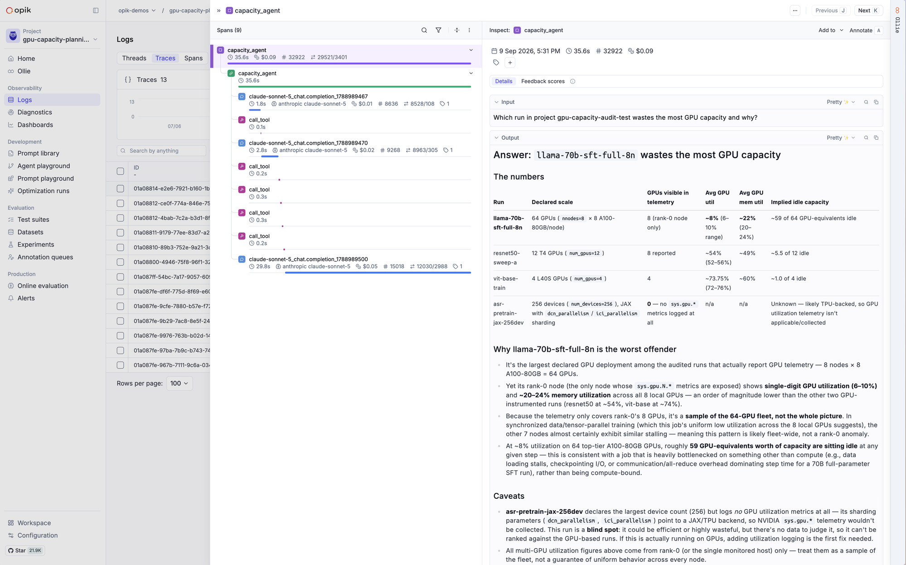

# Comet MCP-driven GPU capacity planning

Pull system metrics from Comet EM training runs through the **Comet MCP server**, flag
under-utilized hardware with simple heuristics, have an **LLM write rightsizing
recommendations**, and trace the whole pipeline in **Opik** so the recommendation runs can be
reviewed (e.g. by Opik Diagnostics).

Beyond the one-shot audit, this guide ships the **full lifecycle**: demo distributed
training runs, a post-training report that joins model quality with capacity efficiency, and
an Opik feedback loop (Prompt Library, annotation queue, online LLM judge, golden dataset,
offline evaluations) that keeps the recommendations themselves accountable - see
[End-to-end workflow](#end-to-end-workflow-train---report---review---improve).

```text
Comet EM training runs
        |  uvx comet-mcp  (or the bundled synthetic server when no COMET_API_KEY)
        v
collector: list_projects -> list_experiments -> details / parameters / metric series
        |        declared scale (num_devices, nnodes, ...)  vs  measured sys.gpu.N.gpu_utilization
        v
analysis: rule-based flags (idle, under-utilized, declared != reporting, CPU-bound)
        |
        v
recommender: one litellm call -> Markdown rightsizing report
        |
        v
Opik trace: capacity_audit - tool spans per MCP call - analyze span - LLM span (tokens/cost)
```

## What this does

Teams pay for far more GPU capacity than their training jobs actually use. In a September
2026 Comet analysis of more than 8,500 GPU training runs across our enterprise customers,
one in four runs never exceeded 15% GPU utilization at any point during training. The money
adds up fast: a 64-GPU job running at 12% utilization on A100-class hardware at typical
on-demand cloud rates of $3-4 per GPU-hour costs roughly $200 per hour, of which about $170
buys idle silicon. That is over $4,000 a day, for one job.

The root cause is usually visibility, not negligence: *booked* capacity (scale parameters
like `num_devices` or `nnodes`) and *actual* utilization (`sys.gpu.*` system metrics) live in
different places and nobody joins them. This guide closes that loop with the Comet ecosystem:
the Comet MCP server exposes EM experiment data as tools, deterministic code sweeps the runs
and compares booked hardware against measured utilization, an LLM turns the findings into
concrete rightsizing recommendations, and Opik records every MCP call, the analysis, and the
LLM call (with token costs) as one trace per audit.

Two commands share the same five MCP tools (`list_projects`, `list_experiments`,
`get_experiment_details`, `get_experiment_parameters`, `get_experiment_metric_data`):

- **`audit`** - deterministic sweep -> findings table -> LLM report. Reproducible, bounded cost.
- **`ask`** - the LLM drives the tools itself in a bounded loop, for free-form questions like
  *"Which projects waste the most GPU hours?"*

## Prerequisites

```bash
uv sync
```

(Or `pip install opik litellm typer mcp`.) Live mode also needs `uvx` on your `PATH` - it
ships with [uv](https://docs.astral.sh/uv/).

| Variable | Needed for | Notes |
|---|---|---|
| `OPIK_API_KEY` / `OPIK_WORKSPACE` | Opik traces + LLM report | Both unset -> **DRY_RUN**: no LLM call, no traces; heuristics still run |
| `ANTHROPIC_API_KEY` | The LLM call via litellm | Or any provider key matching the model you set |
| `OPIK_EXAMPLES_MODEL` | Optional model override | Default `anthropic/claude-sonnet-5` |
| `COMET_API_KEY` / `COMET_WORKSPACE` | Real EM data | Unset -> the bundled **synthetic** MCP server serves `data/sample_runs.json` |
| `COMET_URL_OVERRIDE` / `OPIK_URL_OVERRIDE` | Self-hosted deployments | Optional |
| `OPIK_PROJECT_NAME` | Trace destination | Default `gpu-capacity-planning` |
| `CAPACITY_LOW_UTIL_PCT` / `CAPACITY_IDLE_UTIL_PCT` / `CAPACITY_MAX_RUNS` | Threshold tuning | Defaults 30 / 10 / 50 |
| `CAPACITY_DEVICE_PARAM_KEYS` / `CAPACITY_NODE_PARAM_KEYS` | Which params declare training scale | Defaults `num_gpus,num_devices,world_size` / `nnodes,num_nodes,config/compute/nnodes` |
| `CAPACITY_MODEL_METRIC_KEYS` | Model-quality metrics shown by `report` | Default `precision,recall,f1,accuracy,loss` |
| `CAPACITY_PROMPT_NAME` / `CAPACITY_QUEUE_NAME` / `CAPACITY_DATASET` / `CAPACITY_JUDGE_SCORE` / `CAPACITY_JUDGE_MODEL` | Names of the feedback-loop objects | Defaults `gpu-capacity-analyst` / `capacity-recommendations` / `capacity-recommendations-golden` / `recommendation_quality` / model without provider prefix |

The two credential pairs gate independently, giving three useful modes:

1. **No credentials** - synthetic data + dry run. What CI runs; works offline.
2. **Opik + LLM keys only** - synthetic EM data, real LLM report, real Opik traces. Try the
   full story without a populated EM workspace.
3. **All credentials** - audit your real training runs.

## Running it

```bash
# 1. Dry run (no credentials needed) - synthetic runs, rule-based findings, exit 0
uv run gpu-capacity-planning audit

# 2. Real LLM report + Opik traces over the synthetic runs
export OPIK_API_KEY=... OPIK_WORKSPACE=... ANTHROPIC_API_KEY=...
uv run gpu-capacity-planning audit

# 3. Live against your Comet EM workspace
export COMET_API_KEY=... COMET_WORKSPACE=...
uv run gpu-capacity-planning list-runs                     # collection only, no LLM
uv run gpu-capacity-planning audit -p my-project --output report.md
uv run gpu-capacity-planning ask "Which projects waste the most GPU hours?"
```

### Command reference

`uv run gpu-capacity-planning COMMAND [OPTIONS]` (or `--help` on any command):

| Command | What it does | Options |
|---|---|---|
| `audit` | Sweep runs, flag waste, write the LLM rightsizing report | `--workspace TEXT` (default: `COMET_WORKSPACE`), `-p/--project TEXT` (repeatable; default: all projects), `--max-runs N` (default: 50), `--output PATH` (also write the Markdown report to a file), `--synthetic` |
| `list-runs` | Collection only: the per-run metrics table, no LLM call | `--workspace TEXT`, `-p/--project TEXT`, `--max-runs N`, `--synthetic` |
| `ask QUESTION` | Let the LLM answer a free-form capacity question by driving the MCP tools | `--workspace TEXT`, `--max-turns N` (tool-loop bound, default: 8), `--synthetic` |
| `report` | Post-training report: model quality + capacity + review links, traced and queued | `-p/--project TEXT` (required), `-e/--experiment TEXT` (repeatable; default: all in the project), `--workspace TEXT`, `--output PATH`, `--synthetic` |
| `setup-loop` | Create the Opik feedback loop (prompt, annotation queue, online judge rule) | none |
| `curate` | Copy traces rated at or above the threshold into the golden dataset | `--min-score F` (default: 0.8), `--dataset TEXT`, `--max-items N` (default: 50) |
| `evaluate` | Offline evaluation of the current prompt + model against the golden dataset | `--dataset TEXT`, `--experiment-name TEXT` |

`--synthetic` forces the bundled sample-data server even when Comet credentials are set;
handy for demos and for testing changes without touching a real workspace. Set
`CAPACITY_SAMPLE_DATA=/path/to/your-export.json` (same shape as `data/sample_runs.json`)
to audit your own exported snapshot offline.

## End-to-end workflow: train -> report -> review -> improve

The audit answers "where is the waste?" once. The lifecycle below turns it into a loop your
team can trust: every recommendation is versioned, reviewed, scored, and regression-tested.

```text
1 MEASURE    torchrun train_demo (DDP)  ->  Comet EM: world_size param, loss/precision/recall/F1,
             sys.gpu.* + sys.cpu.* system metrics (logged automatically)
2 RECOMMEND  report  ->  MCP pull -> heuristics -> LLM recommendation
             prompt comes from the Opik Prompt Library (version-pinned, visible as a
             Prompt tab on the trace)  ->  one training_report trace per report
3 REVIEW     the trace lands in an annotation queue for SME rating (feedback score
             "recommendation_quality"); an online LLM judge scores every new trace too
4 IMPROVE    curate: traces rated >= 0.8 -> golden dataset
             evaluate: current prompt + model vs that dataset -> Opik experiment
             (the regression gate for any prompt, code, or model change)
```

### 1. Measure - run the demo training jobs

`train_demo.py` is a small CNN on FashionMNIST, launched with torchrun so the runs look like
real distributed jobs (DDP; `gloo` on CPU, `nccl` on GPUs). Rank 0 logs one Comet EM
experiment with the `world_size` parameter the audit reads as declared scale, per-epoch loss,
final precision/recall/F1, and system metrics - enabled explicitly so the run is auditable
even where a base config switched them off:

```bash
uv sync --extra train        # torch/torchvision/comet_ml/scikit-learn stay out of the core install
export COMET_API_KEY=... COMET_WORKSPACE=...
uv run torchrun --nproc_per_node=2 -m gpu_capacity_planning.train_demo --epochs 2
```

A 2-rank CPU run takes a few minutes and downloads ~30 MB into `.data-cache/`. On a GPU box
the same command (with `--nproc_per_node=<gpus>`) produces real `sys.gpu.N.*` series.

### 2. Recommend - the post-training report

```bash
uv run gpu-capacity-planning setup-loop     # once per workspace: prompt + queue + judge rule
uv run gpu-capacity-planning report -p capacity-demo-training --output report.md
```

`report` joins what the training run achieved (precision/recall/F1/accuracy/loss - names
configurable via `CAPACITY_MODEL_METRIC_KEYS`) with what it cost (utilization, coverage,
estimated wasted GPU-hours), adds links to the EM experiments and the report's own Opik
trace, and has the LLM write the recommendations section. The analyst system prompt is not a
string buried in code: it lives in the **Opik Prompt Library** (`gpu-capacity-analyst`),
`create_prompt` versions it on every text change, and the trace's **Prompt tab** shows
exactly which version produced each recommendation.

### 3. Review - queue, feedback scores, online judge

`setup-loop` creates an annotation queue (`capacity-recommendations`); each `report` adds its
trace there, so reviewers work a queue instead of hunting traces. Rate the recommendation
with the `recommendation_quality` feedback score (0-1) - in the queue UI, or via SDK:

```python
import opik

opik.Opik().log_traces_feedback_scores([{"id": "<trace-id>", "name": "recommendation_quality", "value": 0.9}])
```

`setup-loop` also creates an **online evaluation rule**: an LLM judge that scores every new
`training_report` trace (a name filter keeps it off `ask` and tool-call traces) against the
actionable/grounded/safe rubric in `prompts.py` - it reads both the utilization findings
(trace input) and the recommendation (trace output), so the grounding check is real. The
rule runs inside the Opik platform, so it needs an AI provider key configured in your Opik
workspace (Configuration -> AI providers); the judge model name is `CAPACITY_JUDGE_MODEL`
(default: the `OPIK_EXAMPLES_MODEL` without its provider prefix).

### 4. Improve - golden dataset and offline evaluations

```bash
uv run gpu-capacity-planning curate --min-score 0.8    # rated traces -> golden dataset
uv run gpu-capacity-planning evaluate                  # current prompt+model vs dataset
```

`curate` copies the input/output of highly rated traces into the
`capacity-recommendations-golden` dataset (inserts deduplicate, so re-running is safe).
`evaluate` re-runs the analyst on each stored payload and scores it with the same rubric
(G-Eval), logging an **Opik experiment** - before shipping a prompt tweak, a code change, or
a model swap, run it and compare experiments in the UI. That is the regression gate.
Because the report trace stores its analysis payload as input and the recommendation as
output, every curated trace is directly replayable.

### CI/CD

[cicd/](./cicd/) contains two reference GitHub Actions workflows to copy into your training
repo's `.github/workflows/`:

- [train-and-audit.yml](./cicd/train-and-audit.yml) - manual dispatch: training run ->
  `report` -> report artifact (plus a commented-out Slack notification step).
- [monthly-eval-refresh.yml](./cicd/monthly-eval-refresh.yml) - monthly cron: `curate` ->
  `evaluate`, so the golden dataset grows with fresh ratings and every month produces a
  comparable experiment.

Both keep secrets in `env:` and pin actions by commit SHA, and both assume the guide's
`pyproject.toml` sits at your repo root - if you vendor this folder into a subdirectory,
set the commented `working-directory` in each file. A commented-out Slack block also
sits at the end of `training_report.py` if you'd rather notify from the CLI run itself.

### Going further - Optimization Studio

Once the golden dataset has enough items, let Opik optimize the analyst prompt against it
instead of hand-tuning:

```python
from opik_optimizer import MetaPromptOptimizer  # uv add opik-optimizer

optimizer = MetaPromptOptimizer(model="anthropic/claude-sonnet-5")
# dataset: capacity-recommendations-golden; metric: the same G-Eval rubric as `evaluate`;
# starting prompt: the current gpu-capacity-analyst version from the Prompt Library.
```

The optimized prompt lands back in the Prompt Library as a new version - and because
`evaluate` pins the prompt version on every experiment, you can prove the optimized version
beats the old one on the same dataset before promoting it. One thing to know: the source of
truth for the running system is `ANALYST_SYSTEM_PROMPT` in `prompts.py` - every live run
re-registers that text, so a library-only edit is superseded on the next run. Promoting a
winning version means updating the constant in code. See the
[Opik Agent Optimization docs](https://www.comet.com/docs/opik/agent_optimization/overview).

## How it works

- **`mcp_client.py`** - picks the server (`uvx comet-mcp` live, or
  `python -m gpu_capacity_planning.synthetic_server` bundled) and opens a stdio
  `ClientSession`. `call_tool()` is the single choke point every MCP call goes through, so
  each call becomes an Opik tool span. `openai_tool_defs()` converts the server's MCP schemas
  into OpenAI-format tool definitions for litellm.
- **`collector.py`** - deterministic sweep. For each run: details (name, URL, timestamps,
  available metric names), parameters (declared scale, resolved from the configurable
  `CAPACITY_*_PARAM_KEYS` lists), then one batched `get_experiment_metric_data` call for the
  `sys.gpu.N.*` and CPU series. Produces one `RunMetrics` per run with utilization
  means/peaks and a **coverage** verdict (`full` / `rank0_sample` / `none` - see
  [Distributed training runs](#distributed-training-runs)).
- **`analysis.py`** - pure rules, no LLM: mean GPU utilization under the idle threshold ->
  **high**; under the target threshold -> **medium**; declared != reporting GPU count (and not
  explained by multi-node logging) -> flag; high CPU + idle GPU -> likely dataloader-bound;
  missing metrics -> instrumentation advice.
  Also estimates wasted GPU-hours (`duration * GPUs * (1 - util)` over flagged runs).
- **`recommender.py`** - one `litellm` call turns the findings JSON into the Markdown
  recommendations section. Opik's litellm callback nests the LLM span (model, tokens, cost)
  under the audit trace.
- **`agent.py`** - the `ask` loop: litellm tool-calling against the same MCP session, bounded
  by `--max-turns`.
- **`train_demo.py`** - the demo DDP training job (optional `train` extra); rank 0 logs the
  experiment the rest of the workflow consumes.
- **`training_report.py`** - the `report` command: same collector, plus model-quality metrics
  and review links; stores the analysis payload as trace input so curated traces replay in
  offline evals; adds its trace to the annotation queue.
- **`loop_setup.py`** - idempotent creation of the prompt-library entry, the annotation
  queue, and the online LLM-judge rule.
- **`curation.py` / `offline_eval.py`** - `curate` (rated traces -> golden dataset) and
  `evaluate` (G-Eval of the current prompt+model against it).
- **`synthetic_server.py`** - a FastMCP server that mimics comet-mcp's five tools from
  `data/sample_runs.json` (seven fictional runs: the 8-node/64-GPU/12% offender, a
  256-device JAX run with no system metrics, a healthy LoRA run, a CPU-bound run, a
  declared/reporting mismatch, an uninstrumented run, and a well-utilized baseline - two of
  them carry precision/recall/F1 so `report --synthetic` shows the model-quality table).
  Because it speaks the same tool contract, the dry run exercises the exact code path used
  against production.

## Viewing the results in Opik

Each `audit` produces one trace named **`capacity_audit`** in the `gpu-capacity-planning`
project: `fetch_run` spans per experiment (with the per-run metrics), `call_tool` tool spans
per MCP call, an `analyze` span, and a `write_recommendations` span with the nested LLM call.
Trace tags (`capacity-planning`, `comet-em`, `mcp`, `live`/`synthetic`) and metadata
(workspace, runs analyzed/flagged, GPU-hours, thresholds, model) are the stable contract to
filter or aggregate on - including for automated review of the audit runs themselves via
Opik's trace analysis features. `ask` produces a **`capacity_agent`** trace with one LLM span
per turn plus the tool spans it triggered.

Here is an `ask` run in the Opik UI - the trace tree on the left (LLM spans and tool calls
with per-span timing and token cost), the agent's final capacity answer on the right:



## Distributed training runs

Real workspaces log distributed jobs in three shapes, and the audit handles each:

1. **Single-node multi-GPU** (one experiment, all GPUs report `sys.gpu.N.*`) - full
   coverage; utilization and GPU-hours are measured directly.
2. **Multi-node, rank-0 logging** - the common pattern: one experiment per job, system
   metrics from the node the logging process runs on. The collector marks these
   `rank0_sample` when the declared device count is a multiple of the GPUs reporting (or a
   node-count param says so), and the report extrapolates the reporting node's utilization
   across the declared fleet - labeled as an estimate, with the advice to enable
   system-metric logging on every node. A declared count that is *not* explained this way
   (e.g. 12 declared, 8 reporting) is flagged as a real mismatch instead.
3. **No system metrics at all** - large sharded jobs (JAX/TPU-style, `num_devices` in the
   hundreds) often run with system-metric logging disabled. These surface as
   `coverage: none` with an instrumentation recommendation; in real fleets this is
   frequently the *largest* bucket, which is itself the finding.

Because hardly anyone logs a literal `num_gpus`, the declared scale is resolved from a
configurable parameter list: `CAPACITY_DEVICE_PARAM_KEYS` (total devices - default
`num_gpus,num_devices,world_size`) and `CAPACITY_NODE_PARAM_KEYS` (node count, multiplied by
the GPUs seen per node - default `nnodes,num_nodes,config/compute/nnodes`). Add your
launcher's key if it differs. If your training stack logs only aggregates like
`sys.compute.overall` / `sys.compute.utilized`, note those are cluster-level percentages,
not per-GPU series - the audit needs `sys.gpu.N.gpu_utilization`, which Comet's SDK logs
automatically when system-metric logging is on. One experiment per *worker* (rather than per
job) also works: each worker is audited as its own run, which catches stragglers, but log a
shared scale param to avoid per-worker mismatch flags.

## Setting up the MCP servers

### comet-mcp - required for live mode

The example spawns the [Comet MCP server](https://github.com/comet-ml/comet-mcp) itself via
`uvx comet-mcp` (stdio), so `audit` / `list-runs` / `ask` need no MCP host configuration -
just have [`uv`](https://docs.astral.sh/uv/) on your `PATH` (it provides `uvx`) and export:

```bash
export COMET_API_KEY=...        # comet.com -> account settings -> API key
export COMET_WORKSPACE=...      # the workspace whose training runs to audit
# export COMET_URL_OVERRIDE=... # self-hosted Comet EM only
```

To explore the same workspace **interactively** from Claude Code, Cursor, or any MCP-capable
host, this folder ships a ready [.mcp.json](./.mcp.json) with the same server definition -
the `ask` command is exactly that loop, minus the IDE. Alternative installs (pip, Docker) and
the full tool list are in the [comet-mcp repository](https://github.com/comet-ml/comet-mcp);
Comet EM platform docs live at [comet.com/docs/v2](https://www.comet.com/docs/v2/).

### opik-mcp - optional, for exploring the resulting traces

To dig into the audit traces from your own agent (list projects, query traces, read spans),
add the [Opik MCP server](https://github.com/comet-ml/opik-mcp) next to comet-mcp. One
command registers it with the AI clients on your machine:

```bash
uvx opik mcp configure
```

Or run it directly - `uvx opik-mcp@latest` with `OPIK_API_KEY` / `OPIK_WORKSPACE` set (the
old `npx opik-mcp` distribution is deprecated). Setup guide, troubleshooting, and FAQ:
[comet.com/docs/opik/mcp-server](https://www.comet.com/docs/opik/mcp-server). Opik SDK
configuration (API keys, workspaces, self-hosted URLs) is covered in the
[Opik docs](https://www.comet.com/docs/opik/).
