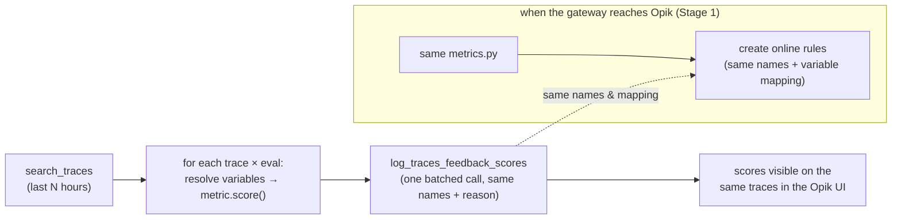

# Score Production Traces

Score **existing production traces** in an Opik project from your own pipeline — using
the same judge/metric classes an [online evaluation rule](https://www.comet.com/docs/opik/production/rules)
would use — and log the scores back onto those traces. For teams whose GenAI gateway
is reachable **from their code but not yet from the Opik platform**: run evals on a cron
now, then switch to platform online rules later with **no re-authoring** (same score
names, same variable mapping).

> **This is not `opik.evaluate()`.** `evaluate()` runs a *task* over a *dataset* to
> generate new outputs and create an experiment (pre-production). This scores traces that
> **already exist** and attaches feedback in place (post-production) — the job online
> rules do. There is no single turnkey SDK call for that, so this example composes three
> primitives: `search_traces` → `metric.score()` → `log_traces_feedback_scores`.

## Prerequisites

- Python 3.12+
- [uv](https://docs.astral.sh/uv/) — this folder is a `uv` project; run `uv sync`
- A GenAI gateway reachable from where you run this (for the LLM judges)

## Environment Setup

| Variable | Required | Default | Description |
|---|---|---|---|
| `OPIK_API_KEY` | for a live run | — | Opik API key (unset → DRY_RUN, no network) |
| `OPIK_WORKSPACE` | for a live run | — | Opik workspace name |
| `OPIK_URL_OVERRIDE` | self-hosted | `https://www.comet.com/opik/api` | Opik API base URL |
| `OPIK_PROJECT_NAME` | no | `score-traces-example` | Project whose traces are scored |
| `EVAL_WINDOW_HOURS` | no | `1` | How far back each run looks |
| `EVAL_MAX_RESULTS` | no | `1000` | Max traces per run; warns on truncation |
| `GATEWAY_BASE_URL` | for LLM judges | — | OpenAI-compatible gateway URL (Path A) |
| `GATEWAY_API_KEY` | for LLM judges | — | Gateway API key |
| `GATEWAY_MODEL` | no | `gpt-4o` | Judge model name |
| `OPENAI_API_KEY` | often | — | OpenAI provider key LiteLLM uses for the `openai/` judge route — set alongside `GATEWAY_*` if the judge errors on auth (see note below) |

> **Judge auth (LiteLLM).** The judges run through LiteLLM, which routes the model as
> `openai/$GATEWAY_MODEL`. Set your gateway via `GATEWAY_BASE_URL` + `GATEWAY_API_KEY`, and
> **also set `OPENAI_API_KEY`** (to your gateway/OpenAI key) — the `openai/` route reads the
> provider key from it and will error on auth without it, even when the `GATEWAY_*` vars are set.

### Credentials & security

- **Never commit or hard-code `OPIK_API_KEY`** or gateway keys — keep them out of `run.sh`,
  source, and the committed `.env.example`. Inject them at runtime from your CI secret store
  or a secret manager; your real `.env` should stay git-ignored.
- Prefer a **dedicated Opik service account** for scheduled/CI runs over a personal API key,
  so the job's access is scoped and can be revoked independently of any individual.

### Running in a pipeline / on a schedule

`OPIK_WORKSPACE` and `OPIK_PROJECT_NAME` are plain env vars — set them wherever the job runs:
export them in your CI/cron pipeline, or edit `run.sh` (the CI entry point). With
`OPIK_API_KEY`/`OPIK_WORKSPACE` unset the run falls back to DRY_RUN and exits 0 without
touching the network, so CI stays green before credentials are wired in.

## Workflow



### Step 0 — seed a test project (optional, no LLM)

```bash
export OPIK_API_KEY=... OPIK_WORKSPACE=...
export OPIK_PROJECT_NAME=score-traces-example
uv run python utils/seed_traces.py   # ~10 hardcoded Q&A traces, good/bad mix
```

### Step 1 — configure the judge model

Edit `model.py`. Path A (default) points LiteLLM at an
OpenAI-compatible gateway via `GATEWAY_BASE_URL` / `GATEWAY_API_KEY`. For a non-standard
gateway, use Path B (a custom `OpikBaseModel` subclass). Both paths, with full worked
examples, are documented here:
<https://www.comet.com/docs/opik/evaluation/metrics/custom_model>
([`LiteLLMChatModel`](https://www.comet.com/docs/opik/python-sdk-reference/Objects/LiteLLMChatModel.html) ·
[`OpikBaseModel`](https://www.comet.com/docs/opik/python-sdk-reference/Objects/OpikBaseModel.html)).
Set `GATEWAY_BASE_URL` + `GATEWAY_API_KEY` + `OPENAI_API_KEY` (see the **Judge auth** note above).

### Step 2 — run the evals

```bash
export EVAL_WINDOW_HOURS=1
uv run python score_traces.py     # scores the last hour, logs feedback back
```

Open the project in Opik — each trace now carries `hallucination`, `relevance`, and
`exact_match` feedback scores, each with the judge's **reason**.

## How it works (the primitives)

The runner is nothing more than three public SDK primitives composed in a loop:

**1. Pull existing traces**

```python
import opik
client = opik.Opik(project_name="score-traces-example")
traces = client.search_traces(
    project_name="score-traces-example",
    filter_string='start_time >= "2026-07-29T00:00:00Z"',
    max_results=1000,
)
trace = traces[0]
print(trace.id, trace.input, trace.output)   # input/output are dicts
```

**2. Score one trace with a metric + variable mapping**

```python
from opik.evaluation.metrics import Hallucination
judge = Hallucination(model="gpt-4o", name="hallucination")

# variable mapping: metric score() param -> trace field path
variables = {"input": "input.question", "output": "output.answer", "context": "output.context"}
kwargs = {"input": trace.input["question"],
          "output": trace.output["answer"],
          "context": trace.output["context"]}
result = judge.score(**kwargs)
print(result.value, result.reason)
```

**3. Write the score back onto the trace**

```python
client.log_traces_feedback_scores([
    {"id": trace.id, "name": "hallucination", "value": result.value, "reason": result.reason},
])
```

**Put it together:** `score_traces.py` is exactly these three steps — for every eval in
`EVALS`, over every trace in the window, with one batched write at the end. Schedule
it on a cron (e.g. hourly with `EVAL_WINDOW_HOURS=1`).

## Adding or changing evals

Edit the `EVALS` list in `metrics.py`. Each `Eval` has a `name` (the feedback-score name),
a live `metric` object, and a `variables` mapping (metric `score()` param → trace field
path). Copy a block to add one. Three styles ship:

| Eval | Type | Migrates to an online rule as |
|---|---|---|
| `hallucination` | built-in preset judge | the platform preset — same engine, **same score name** (strong, not a literal string copy) |
| `relevance` | G-Eval custom judge | an `llm_as_judge` rule — criteria text + name map directly (**clean**) |
| `exact_match` | Python metric (`metrics.py`) | a `user_defined_metric_python` rule — the exact source round-trips (**perfect**) |

The `variables` mapping is the same **"variable mapping"** you set on a rule in the Opik UI —
so when you migrate, the mapping and score names carry over verbatim and your dashboards
don't change. G-Eval's `score()` evaluates a single labeled `output` string, not separate
kwargs, so for `relevance` the runner composes that string from `variables` (e.g.
`INPUT: ...\nOUTPUT: ...`) — the mapping still names the same trace fields an online G-Eval
rule would map.

## Roadmap (not in this example)

- **Stage 1 — promote to online rules.** A small script reading the same `metrics.py`
  and creating the online rules (reuses
  [`scripts/online_eval_rules`](../online_eval_rules)). For multi-output custom judges it
  adds an output-schema hint.
- **Stage 2 — productionize.** Config-driven CLI; **watermarking** (persist a last-processed
  timestamp instead of a fixed window); **span- and thread-scope** evaluation. A large
  custom Path B model can also move into its own `model_provider.py`.
